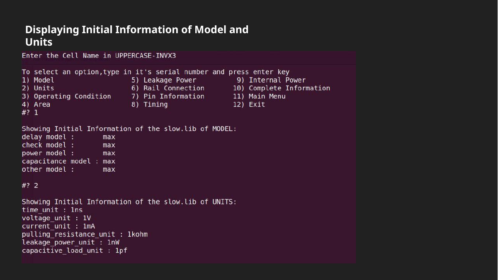
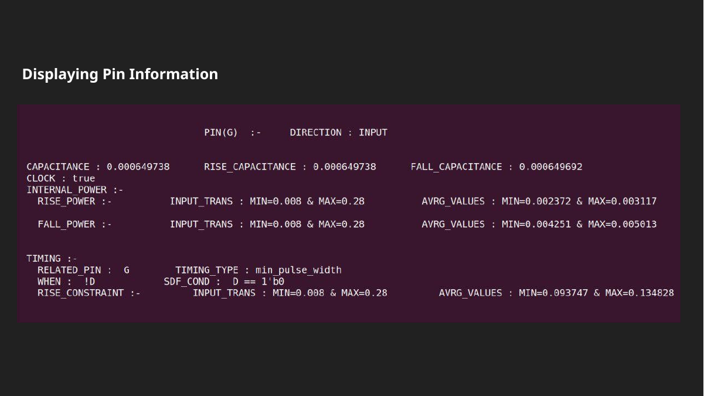
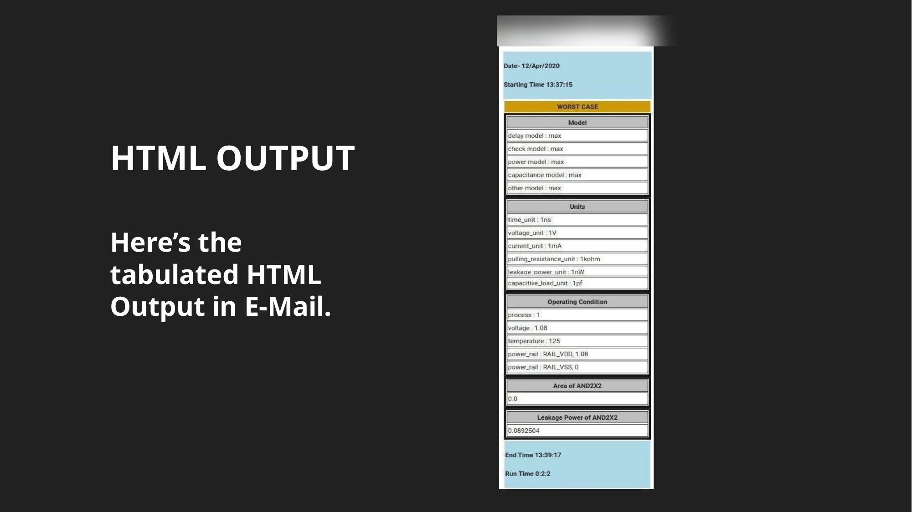

# Liberty (`.lib`) Standard-Cell HTML Report Generator

A pure-**Bash** tool that parses **Liberty (`.lib`) standard-cell library** files, lets you query a
cell's characteristics for the **worst-case** and **best-case** timing corners, renders the result
as a formatted **HTML report**, and can **email** that report straight from the terminal.

No heavy dependencies — just standard Unix tools: `bash`, `grep`/`egrep`, `sed`, `awk`, plus `bc`
for the run-time timer (and `mailx`/`mailutils` only if you use the optional email step). A
deliberate exercise in doing structured EDA-data extraction with nothing but the shell, on the
same `.lib` files a synthesis / place-and-route flow consumes.

---

## See it run

The tool is fully menu-driven — pick a corner, query a cell (or browse the library), and read back
its model, units, operating conditions, area, leakage, pins, timing and internal power:



Per-pin detail — direction, capacitance, internal power and timing arcs:



The "Whole Information" option assembles everything into an **HTML table** and (optionally) emails it:



---

## Features

- **Two corners, two libraries:**
  - **Worst case →** `slow.lib` (slow process / low voltage / high temp)
  - **Best case →** `fast.lib` (fast process / high voltage / low temp)
- **Find a cell two ways:**
  - Know the name? Enter it in UPPERCASE (e.g. `NAND2X1`).
  - Don't? Browse the library — cells are listed by **category**: basic gates
    (INV, AND, OR, NAND, NOR, XOR, XNOR, BUF, TBUF), multiplexers, adders, tie cells, AOI/OAI,
    delay cells — each with its available drive strengths.
- **Per-cell queries:** Model · Units · Operating Condition · Area · Leakage Power · Rail Connection ·
  Pin Information · Timing · Internal Power · **Whole Information** (full HTML report).
- **HTML report** generation, with an option to **email** it (basic address validation included).

## How it works

The script walks Liberty syntax with shell text-processing — locating `cell (...)` blocks with
`grep`, slicing each cell with `sed` address ranges (`/<cell>/,/^}/`), and pulling attributes
(`area`, `cell_leakage_power`, `pin` direction, `timing`, `internal_power`) with `awk`/`sed`. The
extracted values are emitted as an HTML `<table>`. It's a compact demonstration of parsing a real,
deeply-nested EDA data format using only the standard shell toolchain.

## Usage

Requires `bash`, `grep`, `sed`, `awk`, `bc` (preinstalled on most Linux/macOS; on Debian/Ubuntu:
`sudo apt install bc`). The optional email step also needs `mailutils`/`mailx`.

```bash
# fast.lib (best case) and slow.lib (worst case) must be in the working directory
chmod +x main.sh
./main.sh           # or: bash main.sh
```

Then follow the prompts: **corner → cell (by name or category) → query → HTML report → optional email.**

### Sample libraries — included, synthetic

This repo ships small **synthetic** `fast.lib` / `slow.lib` (generated by
[`gen_sample_libs.py`](gen_sample_libs.py)) so the tool runs out of the box on ~12 representative
cells across the supported categories.

> The original project was developed against **Cadence GPDK045** corner libraries. Those are
> **licensed PDK files and are not redistributed here.** To run against real data, drop in your own
> Liberty `.lib` files (any PDK you're licensed for, or an open library such as SkyWater **sky130**
> or **Nangate OpenCell**) named `slow.lib` and `fast.lib`.

## Repository layout

```
main.sh              the tool
fast.lib / slow.lib  small synthetic corner libraries (best / worst case)
gen_sample_libs.py   generator for the synthetic libraries
docs/                project report & presentation (the flow, the methodology) + screenshots
README.md
LICENSE
```

## Origin & credits

Originally a **Group-9 project at PinE Training Academy (2020)** — built during physical-design
training to apply our Bash learnings to a practical EDA task (reading the `.lib` files a real
PD/synthesis flow consumes).

**Contributors:**
- **Sarosh** — [github.com/ChargeInMotion](https://github.com/ChargeInMotion)
- **Kajal Pathak** — [github.com/kjpathak](https://github.com/kjpathak)
- **Nikhil Jain**

## License

MIT — see [LICENSE](LICENSE).
